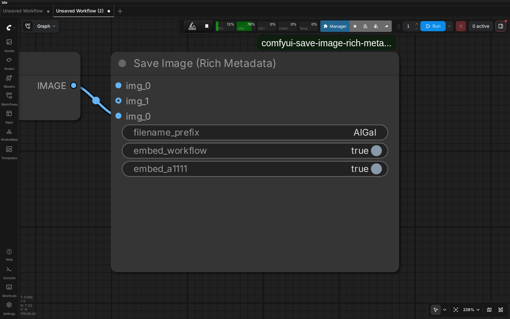
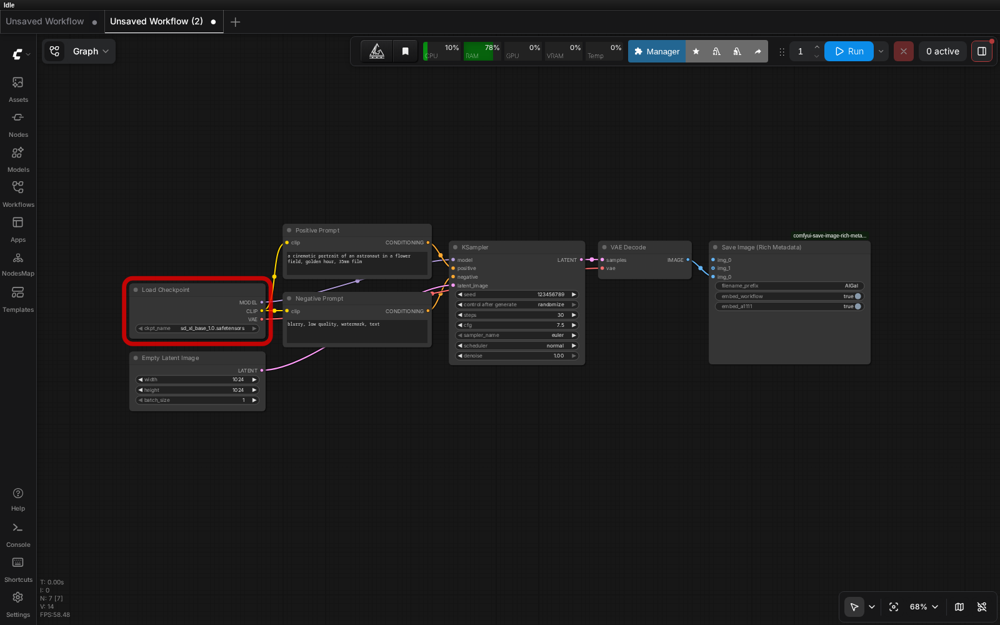
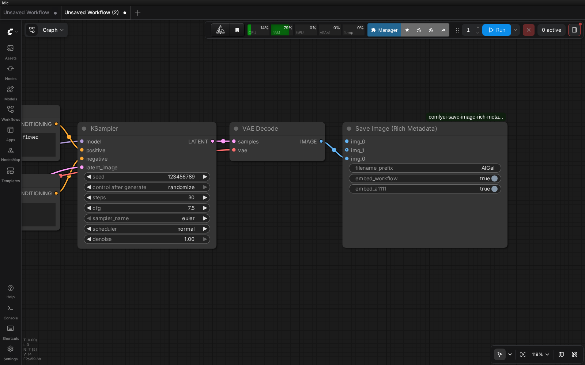

# ComfyUI — Save Image (Rich Metadata)

A drop-in replacement for ComfyUI's `SaveImage` that writes **rich, multi-format
metadata** into every PNG — fully compatible with **A1111 / CivitAI**, plus a
clean authoritative JSON chunk consumed by the
[AI Gallery](https://github.com/quzopl/ai-gallery) app.

Built on the ComfyUI v3 API with `Autogrow` — **unlimited image input slots**
(framework cap: 100).



## What it writes

Each PNG gets three `tEXt` chunks:

| Chunk | Format | Purpose |
|---|---|---|
| `ai_gallery_meta` | JSON | Canonical, authoritative metadata (consumed by AI Gallery, no heuristics needed) |
| `prompt` + `workflow` | JSON | Standard ComfyUI — drag the image back to ComfyUI to restore the workflow |
| `parameters` | A1111 text | CivitAI, stable-diffusion-webui, A1111 ecosystem |

### CivitAI compatibility

The `parameters` chunk follows the A1111 webUI format exactly, including
**resource hashes** so CivitAI auto-detects and links the checkpoint and LoRAs:

```
<positive prompt> <lora:name_1:weight_1> <lora:name_2:weight_2> …
Negative prompt: <negative prompt>
Steps: N, Sampler: name, CFG scale: X, Seed: N, Size: WxH, Model hash: abc123def456, Model: name, Lora hashes: "name_1: 0011aabbccdd, name_2: …", Hashes: {"model": "abc123def456", "lora:name_1": "0011aabbccdd"}
```

This is the canonical format CivitAI's PNG inspector parses on upload — drop
any image saved by this node onto CivitAI and the positive prompt, negative
prompt, model, sampler, steps, CFG, seed, dimensions and inline LoRAs are
extracted automatically, and the model/LoRA **resource pages are linked** via
their hashes.

**Hashes** are the **AutoV2** form (first 12 hex of the file's SHA256), computed
for the checkpoint/UNet (searched in `checkpoints` → `diffusion_models` →
`unet`) and every LoRA (`loras`). Each file is hashed once and cached in
`.hash_cache.json` (keyed by path + size + mtime), so the first save after
loading a new model is slower and subsequent saves are instant. Nothing is
written next to your model files.

## What it extracts from the workflow

Walks the execution graph (no keyword guessing):

- **prompt** — traces `KSampler.inputs.positive` → `CLIPTextEncode.text`
- **negative** — traces `KSampler.inputs.negative` → `CLIPTextEncode.text`
- **sampler, steps, cfg, seed** — from `KSampler` / `SamplerCustom`
- **model_name** — from `CheckpointLoader*` / `UNETLoader*` / `UnetLoader*`
- **loras** — from all LoRA loaders:
  - stock `LoraLoader`, `LoraLoaderModelOnly`
  - rgthree `Power Lora Loader` (dict slots, respects `on: false`)
  - LoRA Stack loaders (`lora_name_1`, `lora_name_2`, …)

### Custom samplers & runtime prompt builders

The graph walk also handles modern Flux / SD3-style pipelines where the prompt
isn't a plain static string on the sampler:

- **Guider-based custom samplers** — `SamplerCustomAdvanced` and friends route
  conditioning through a `guider` node (`BasicGuider`, `CFGGuider`,
  `DualModelGuider`, …) instead of exposing `positive`/`negative` directly.
  We follow the `guider` link to recover both, and read `cfg` from it.
- **Ideogram 4 Prompt Builder (KJNodes)** — this node *computes* its caption
  JSON at runtime, so there's no static `text` anywhere in the graph. We
  reproduce the builder's exact assembly from its inputs
  (`high_level_description`, `background`, `style_description`, `elements`,
  color palettes) to recover the real prompt that conditioned the image.
- **`ConditioningZeroOut`** — treated as an empty negative, so a zeroed-out
  negative branch never echoes the positive prompt it wraps.

## Screenshots

### Full workflow



### Pipeline tail (KSampler → VAEDecode → Save Image)



## Install

```bash
cd ComfyUI/custom_nodes
git clone https://github.com/quzopl/comfyui-save-image-rich-metadata.git
```

Restart ComfyUI. The node appears as **Save Image (Rich Metadata)** in the
`image` category.

Requires ComfyUI with the v3 API (`comfy_api.latest`) — present in all
recent releases.

## Usage

Replace `SaveImage` in your workflow with **Save Image (Rich Metadata)**.
Connect the `images` input, set `filename_prefix` (e.g., `MyRender`).

### Unlimited image inputs

The `images` input is an **autogrow slot** — the node UI adds a new empty
slot whenever you connect one. Plug in as many independent image batches as
you want (e.g., raw + refine + upscale + variations all in one workflow).

Each connected batch is saved separately:

- Slot 1 → `filename_prefix`
- Slot 2 → `filename_prefix_2`
- Slot 3 → `filename_prefix_3`
- … and so on

All slots share the same workflow metadata (same `ai_gallery_meta`,
`prompt`/`workflow`, and `parameters` chunks) since they're produced by the
same execution graph.

### Optional flags

- `embed_workflow` (default ON) — also embed standard ComfyUI chunks
- `embed_a1111` (default ON) — also embed A1111-compatible `parameters`
  (turn off only if you need a minimal PNG for some reason)

## Dependencies

None. Uses only Pillow and NumPy (both already shipped with ComfyUI).

## License

MIT
